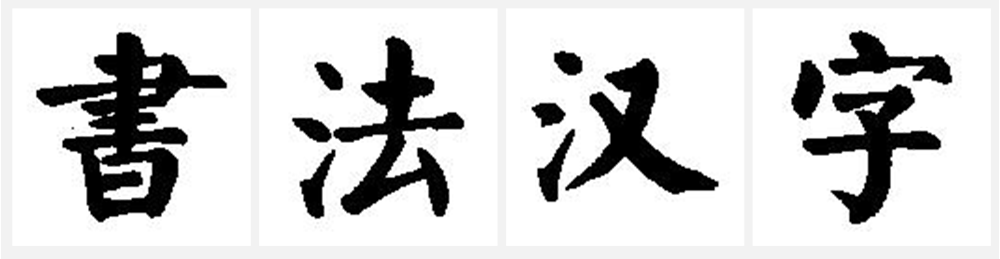

# 颜真卿书法家楷书风格的书法汉字图像数据集

<center>

</center>

颜真卿书法家楷书风格的书法汉字图像数据集，图像数共计1014张，已开源。

## 目录结构
```
Kaiti
├── shuti 楷书书法汉字图像
├── trian_sk 标准印刷体汉字的结构图
└── yinti 标准印刷体汉字图像 
```


## 百度云盘链接

如果本仓库下载有困难，请使用百度云盘
链接：https://pan.baidu.com/s/1zTGa6-Lbd5Z_Ix9Px4yMGA 
提取码：icqa 

